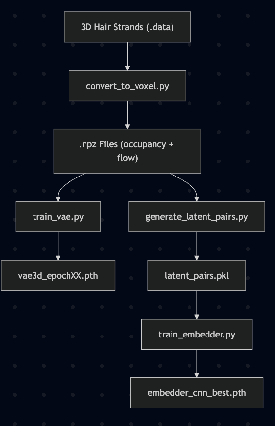

## 🧭 Project Pipeline Overview

The following diagram shows the end-to-end pipeline from raw strand-based hair models to 3D reconstruction from images:



It is important to note that as the dataset used to train the models is big, it is not included in the submission. However, it can be downloaded from the HairSalon Dataset website.

# 📁 VAE3D_Model

This folder contains the implementation of the **3D Volumetric Variational Autoencoder (VAE)** used for learning a latent representation of 3D hair shapes, following the method described in _"3D Hair Synthesis Using Volumetric Variational Autoencoders"_.

## 📄 Files Description

- `model_vae.py`
  Defines the `VAE3D` class, a 3D convolutional VAE that encodes 4-channel voxel volumes (occupancy + flow) into a compact latent space and decodes them back.

- `train_vae.py`
  Script to train the VAE on voxelized `.npz` hair data. Includes model saving, logging, and CPU support.

- `train_vae_gpu.py`
  Script to train the VAE on voxelized `.npz` hair data. Includes model saving, logging, and GPU support.

- `dataset_voxels.py`
  Provides the `VoxelHairDataset` class for loading `.npz` files containing `occupancy` and `flow` fields and formatting them into `(4, D, H, W)` tensors.

- `test_vae_compare.py`
  This script loads a trained 3D VAE model and a .npz hair volume file (containing occupancy and flow fields), passes the volume through the VAE to obtain a reconstructed version, and then visualizes both the original and reconstructed data
  It is mainly used to evaluate how well the VAE has learned to reconstruct hair shape and orientation from a compressed latent representation.
- `vae3d_epoch200.pth`
  Contains the trained VAE Model to be used in the above files

# 📁 CNN

This folder contains the implementation of the **image-to-latent CNN embedder** used to project 2D rendered hairstyle images into the latent space of the 3D hair VAE model.This CNN is used to map an image of a hairstyle (black background, white hair) to the latent representation expected by the 3D VAE.

## 📄 Files Description

- `train_embedder.py`
  Trains the CNN to map rendered hairstyle images to latent vectors, using ground truth pairs from `latent_pairs.pkl`. The training is done on the HairSalon Dataset introduced by the paper`3D Hair Synthesis Using Volumetric Variational Autoencoders` by Saito et al.

- `embedder_cnn_best.pth`
  The saved weights of the best-performing trained CNN model.

- `inference_embedder.py`
  Loads the trained CNN and runs inference to embed a new input image into latent space.

- `latent_pairs.pkl`
  A pickle file storing pairs of `(image, latent vector)` used for training the CNN.

- `latents.npz`
  (Optional) Compressed `.npz` file storing a large set of latent vectors extracted from `.pkl`.

- `extract_latents_from_pkl.py`
  Extracts latent vectors from `latent_pairs.pkl` and saves them in a format suitable for PCA analysis.

- `run_pca.py`
  Runs Principal Component Analysis (PCA) on the latent vectors to reduce dimensionality and saves the PCA model as `pca_model.pkl`.

- `pca_model.pkl`
  Trained PCA model used to reduce the dimensionality of latent vectors during training or inference.

- `voxel2strands_data.py`
  Converts reconstructed voxel outputs (occupancy + flow) to `.data` format strands for further visualization or animation.

- `voxel2strands_obj.py`
  Converts voxel predictions into `.obj` file with strand lines (geometry), viewable in Blender or MeshLab.

# 📁 Main Folder(Outside)

## 📄 Files Description

- `convert_to_voxel.py`
  Converts .data strand-based 3D hair models (from the HairSalon dataset) into .npz voxel volumes

- `generate_latent_pairs.py`
  Encodes each voxel .npz file using the VAE encoder and pairs it with its corresponding rendered image, storing both in a .pkl file for CNN training.

## ✅ TESTING

To verify that the VAE and CNN embedder are working correctly, run the following test scripts.

---

### 🔍 1. Test VAE Reconstruction Accuracy

Run `test_vae_compare.py` to compare the original voxel file(provided as example.npz) with the VAE-reconstructed output. Note that this should be run inside the VAE_Model folder in a terminal.

```bash
python test_vae_compare.py
```

This script:

- Loads a .npz file with occupancy and flow
- Encodes and decodes it using the trained VAE
- Plots a visual comparison of original vs reconstructed slices

Expected Output:

- A 2×2 subplot with:
- Original Occupancy (Z-slice)
- Reconstructed Occupancy
- Original Flow Field (XY)
- Reconstructed Flow Field

### 🔍 2. Test Full Inference from Image

Run interface_embedder.py to test the complete pipeline from image → latent vector → 3D volume. Note that this could be run in the CNN folder in a terminal.

```bash
python interface_embedder.py
```

This script:

- Loads an input image (black background, white hair only)
- Uses the CNN to embed it into a latent vector
- Passes the latent vector through the VAE decoder
- Saves the reconstructed volume as reconstructed_voxel.npz

After getting the reconstructed voxel run:

Expected Output:

- a reconstructed_voxel.npz file inside the CNN folder

```bash
python voxel2strands_data.py
```

This script:

- Takes the .npz file as an input and created the .data file which is expected by Blender

Expected Output:

- In the terminal number of strands created should be printed.
- an reconstructed_voxel.data file inside the CNN folder

This .data file can be loaded into Blender, an the 3D hair model created from the input image can be seen clearly.
